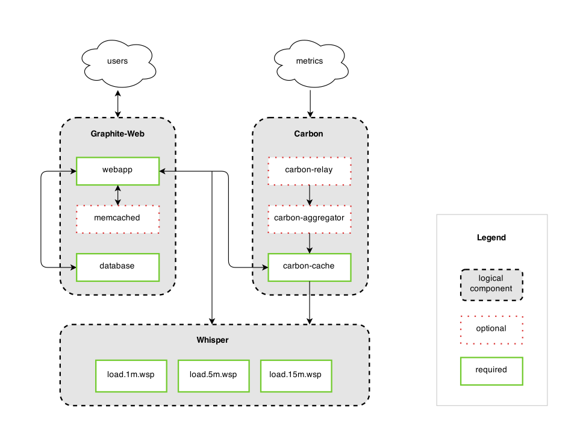

FAQ
===

What is Graphite?
-----------------
Graphite is a highly scalable real-time graphing system. As a user, you write an application that collects numeric time-series data that you are interested in graphing, and send it to Graphite's processing backend, :doc:`carbon </carbon-daemons>`, which stores the data in Graphite's specialized database. The data can then be visualized through graphite's web interfaces.

Who should use Graphite?
------------------------
Anybody who would want to track values of anything over time.  If you have a number that could potentially change over time, and you might want to represent the value over time on a graph, then Graphite can probably meet your needs.

Specifically, Graphite is designed to handle numeric time-series data. For example, Graphite would be good at graphing stock prices because they are numbers that change over time. Whether it's a few data points, or dozens of performance metrics from thousands of servers, then Graphite is for you. As a bonus, you don't necessarily know the names of those things in advance (who wants to maintain such huge configuration?); you simply send a metric name, a timestamp, and a value, and Graphite takes care of the rest!

How scalable is Graphite?
-------------------------
From a CPU perspective, Graphite scales horizontally on both the frontend and the backend, meaning you can simply add more machines to the mix to get more throughput. It is also fault tolerant in the sense that losing a backend machine will cause a minimal amount of data loss (whatever that machine had cached in memory) and will not disrupt the system if you have sufficient capacity remaining to handle the load.

From an I/O perspective, under load Graphite performs lots of tiny I/O operations on lots of different files very rapidly. This is because each distinct metric sent to Graphite is stored in its own database file, similar to how many tools (drraw, Cacti, Centreon, etc) built on top of RRD work. In fact, Graphite originally did use RRD for storage until fundamental limitations arose that required a new storage engine.

High volume (a few thousand distinct metrics updating every minute) pretty much requires a good RAID array and/or SSDs. Graphite's backend caches incoming data if the disks cannot keep up with the large number of small write operations that occur (each data point is only a few bytes, but most standard disks cannot do more than a few thousand I/O operations per second, even if they are tiny). When this occurs, Graphite's database engine, whisper, allows carbon to write multiple data points at once, thus increasing overall throughput only at the cost of keeping excess data cached in memory until it can be written.

Graphite also supports :doc:`alternative storage backends </storage-backends>` which can greatly change these characteristics.

How real-time are the graphs?
-----------------------------
Very. Even under heavy load, where the number of metrics coming in each time interval is much greater than the rate at which your storage system can perform I/O operations and lots of data points are being cached in the storage pipeline (see previous question for explanation), Graphite still draws real-time graphs. The trick is that when the Graphite webapp receives a request to draw a graph, it simultaneously retrieves data off the disk as well as from the pre-storage cache (which may be distributed if you have multiple backend servers) and combines the two sources of data to create a real-time graph.

Who already uses Graphite?
--------------------------
Graphite was internally developed by `Orbitz`_ where it is used to visualize a variety of operations-critical data including application metrics, database metrics, sales, etc. At the time of this writing, the production system at Orbitz can handle approximately 160,000 distinct metrics per minute running on two niagra-2 Sun servers on a very fast SAN.

What is Graphite written in?
----------------------------
Python2. The Graphite webapp is built on the `Django`_ web framework and uses the ExtJS javascript GUI toolkit. The graph rendering is done using the Cairo graphics library. The backend and database are written in pure Python.

Who writes and maintains Graphite?
----------------------------------
Graphite was initially developed by `Chris Davis`_ at `Orbitz`_. Orbitz has long been a part of the open source community and has published several other internally developed products.

Graphite is currently developed by a team of volunteers under the `Graphite-Project`_ GitHub Organization.

What license is Graphite released under?
----------------------------------------
The `Apache 2.0 License`_.

Does Graphite use RRDtool?
--------------------------
No, not since Graphite was first written in 2006 at least. Graphite has its own specialized database library called :doc:`whisper </whisper>`, which is very similar in design to RRD, but has a subtle yet fundamentally important difference that Graphite requires. There are two reasons whisper was created. The first reason is that RRD is designed under the assumption that data will always be inserted into the database on a regular basis, and this assumption causes RRD behave undesirably when given irregularly occurring data. Graphite was built to facilitate visualization of various application metrics that do not always occur regularly, like when an uncommon request is handled and the latency is measured and sent to Graphite. Using RRD, the data gets put into a temporary area inside the database where it is not accessible until the current time interval has passed *and* another value is inserted into the database for the following interval. If that does not happen within an allotted period of time, the original data point will get overwritten and is lost. Now for some metrics, the lack of a value can be correctly interpreted as a value of zero, however this is not the case for metrics like latency because a zero indicates that work was done in zero time, which is different than saying no work was done. Assuming a zero value for latency also screws up analysis like calculating the average latency, etc.

The second reason whisper was written is performance. RRDtool is very fast; in fact it is much faster than whisper. But the problem with RRD (at the time whisper was written) was that RRD only allowed you to insert a single value into a database at a time, while whisper was written to allow the insertion of multiple data points at once, compacting them into a single write operation. This improves performance drastically under high load because Graphite operates on many many files, and with such small operations being done (write a few bytes here, a few over there, etc) the bottleneck is caused by the *number of I/O operations*. Consider the scenario where Graphite is receiving 100,000 distinct metric values each minute; in order to sustain that load Graphite must be able to write that many data points to disk each minute. But assume that your underlying storage can only handle 20,000 I/O operations per minute. With RRD (at the time whisper was written), there was no chance of keeping up. But with whisper, we can keep caching the incoming data until we accumulate say 10 minutes worth of data for a given metric, then instead of doing 10 I/O operations to write those 10 data points, whisper can do it in one operation. The reason I have kept mentioning "at the time whisper was written" is that RRD now supports this behavior. However Graphite will continue to use whisper as long as the first issue still exists.

How do I report problems or request features for Graphite?
----------------------------------------------------------
Please post any feature requests or bug reports to the `GitHub Issues`_ page.

Is this Graphite related to the SIL font rendering graphite?
------------------------------------------------------------
No. SIL Graphite is completely unrelated to this Graphite.

Is this Graphite related to the sourceforge project called graphite?
--------------------------------------------------------------------
No. The sourceforge project called graphite is completely unrelated to this Graphite.

Is there a diagram of Graphite's architecture?
----------------------------------------------
There sure is! Here it is:

.. _Django: http://www.djangoproject.com/
.. _Cairo: http://www.cairographics.org/
.. _RRD: http://oss.oetiker.ch/rrdtool/
.. _Chris Davis: mailto:chrismd@gmail.com
.. _Orbitz: http://www.orbitz.com/
.. _Sears: http://www.sears.com/
.. _Graphite-Project: https://github.com/graphite-project/
.. _Apache 2.0 License: http://www.apache.org/licenses/LICENSE-2.0.html
.. _GitHub Issues: https://github.com/graphite-project/graphite-web/issues
